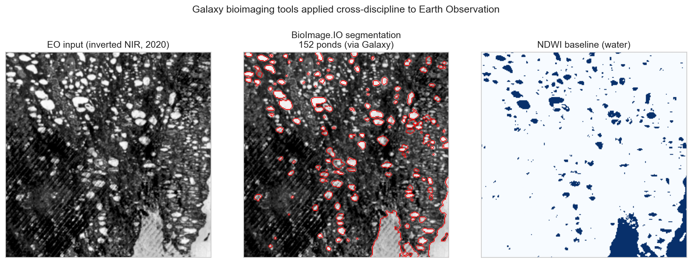

# fiesta-galaxy-bioimageio-eo

[](https://github.com/annefou/fiesta-galaxy-bioimageio-eo/actions/workflows/ci.yml)
[](https://annefou.github.io/fiesta-galaxy-bioimageio-eo/)
[](https://github.com/annefou/fiesta-galaxy-bioimageio-eo/pkgs/container/fiesta-galaxy-bioimageio-eo)
[](https://opensource.org/licenses/MIT)
[]({{ZENODO_DOI}})
[](docs/fair4rs-checklist.md)
[](https://forrt.org/)
[](nanopubs/PUBLISHED.md)
[](ro-crate-metadata.json)
[](https://archive.softwareheritage.org/browse/origin/?origin_url=https://github.com/annefou/fiesta-galaxy-bioimageio-eo)

> **Galaxy bioimaging tools, applied cross-discipline to Earth Observation.**
> A BioImage Model Zoo *nucleus-segmentation* model — trained only on fluorescence microscopy — run **unchanged** through a Galaxy workflow to segment water bodies (thermokarst ponds) in satellite imagery.

Part of **OSCARS-FIESTA** (cross-image analysis *with Galaxy*). This is **not** a replication of a paper: it reuses and extends the Galaxy Training Network tutorial *"Using BioImage.IO models for image analysis in Galaxy"* ([`gxy.io/GTN:T00534`](https://gxy.io/GTN:T00534)) and the BioImage Model Zoo *NucleiSegmentationBoundaryModel* ([10.5281/zenodo.6647674](https://doi.org/10.5281/zenodo.6647674)), applying the same Galaxy workflow to Earth-observation data. It produces a reproducible pipeline, a Zenodo-archived release with a citable DOI, and a Science Live nanopublication chain.

## Result

On a 2020 Landsat scene of the Alaska Arctic Coastal Plain, the bioimaging model — run on **usegalaxy.eu** — segmented **152 thermokarst ponds** (≈221 km² of water), within ~5 % of the standard NDWI water index (≈211 km²). Across all five peak-summer scenes tested (2000–2020) the model's water area stays within **0.74–1.19×** of NDWI, showing robust cross-discipline transfer. *(Year-to-year differences reflect annual-composite quality — cloud/snow/radiometry — and are **not** a climate trend; see `notebooks/03_analysis.py`.)*



## Two ways to run — Galaxy first

This repo foregrounds the **Galaxy** path (FIESTA is about cross-image analysis *with Galaxy*):

- **Galaxy (showcased):** `notebooks/03_analysis.py` invokes [`workflow/main_workflow.ga`](workflow/main_workflow.ga) on **usegalaxy.eu** via BioBlend. Needs a usegalaxy.eu API key at `~/.galaxy_eu_key`. The actual runs are **public** — inspect tool versions, parameters and datasets in the [shared Galaxy history](https://usegalaxy.eu/u/annefou/h/fiesta-bioimage-io-on-eo) (invocation IDs in [`results/galaxy_provenance.json`](results/galaxy_provenance.json)).
- **Local fallback (CI / hermetic):** the *same algorithm* offline (TorchScript `torch.load` + `foreground − boundaries` + threshold 0.6 + connected-component label) — **validated byte-identical** to the Galaxy mask (IoU = 1.000); local and Galaxy give the same water area and pond count on all five scenes (2020: 152 both ways) — so the Jupyter Book builds without a key.

---

## Quick start

```bash
git clone https://github.com/annefou/fiesta-galaxy-bioimageio-eo.git
cd fiesta-galaxy-bioimageio-eo
pixi install
pixi run snakemake --cores 1
```

(Pixi resolves `pixi.toml` against the per-platform `pixi.lock`, installs the env under `.pixi/`, and provides `pixi run` for any task without needing an `activate` step.)

Or with Docker:

```bash
docker run --rm ghcr.io/annefou/fiesta-galaxy-bioimageio-eo:latest
```

The Jupyter Book version is at <https://annefou.github.io/fiesta-galaxy-bioimageio-eo/>.

## Built from a template

This repository was created from [`sciencelivehub/forrt-replication-template`](https://github.com/sciencelivehub/forrt-replication-template). The template ships an operating manual for AI assistants ([`CLAUDE.md`](CLAUDE.md), [`AGENTS.md`](AGENTS.md)), domain conventions ([`DOMAIN.md`](DOMAIN.md)), and reference docs (`docs/`) so that an AI working only inside this repository can guide a researcher from "paper PDF + GitHub repo" to "published FORRT chain + Zenodo DOI" with no other context.

If you are reading this in a fresh fork, run [`/init-template`](.claude/skills/init-template/SKILL.md) inside Claude Code to substitute the placeholder tokens with your details. (For other AI tools, see [`docs/ai-portability.md`](docs/ai-portability.md).)

After `/init-template`, do these one-time setup steps to enable the full CI/CD path:

- **Enable GitHub Pages** at *Settings → Pages → Source: GitHub Actions*. Until enabled, the Jupyter Book build runs but the deploy step is skipped (CI stays green).
- All three workflows share one **readiness guard** (`.github/actions/check-ready`). Before `/init-template` runs, the `.template-uninitialised` sentinel makes them skip with an informative `::notice::` (badges stay green); `/init-template` deletes the sentinel, which activates them. They also skip while `notebooks/*.py` are still scaffolds (Phase 2). **Once you've published a nanopub chain** (real URIs in `nanopubs/PUBLISHED.md`), a skip is treated as a bug and **fails the run loudly** — so a finished replication can't sit on silently-green-but-empty CI.

## Repository structure

```
.
├── CLAUDE.md / AGENTS.md       # operating manual for AI assistants
├── DOMAIN.md                   # domain flavour (current: biodiversity + earth observation)
├── USER_PREFERENCES.md         # per-user style (edit on first clone)
├── README.md                   # this file
├── LICENSE                     # MIT
├── CITATION.cff                # how to cite
├── codemeta.json               # software metadata (CodeMeta-2.0)
├── ro-crate-metadata.json      # research object packaging (RO-Crate 1.2)
├── pixi.toml + pixi.lock       # pinned dependencies (single source of truth; lockfile is per-platform)
├── Dockerfile                  # container build
├── Snakefile                   # pipeline orchestration
├── myst.yml + index.md         # Jupyter Book scaffold
├── paper/                      # the source paper PDF
├── data/                       # downloaded artefacts (gitignored)
├── notebooks/                  # jupytext .py pipeline (01–04)
├── nanopubs/                   # FORRT chain drafts + published-URI registry
├── docs/                       # reference material
├── figures/                    # curated figures used in the Jupyter Book
├── .github/workflows/          # CI, Jupyter Book, Docker
└── .claude/                    # Claude Code agents, skills, sandbox config
```

## What you get

This template bakes in conventions that took multiple replications to discover. By using it, you inherit:

- **FAIR4RS conformance** — see [`docs/fair4rs-checklist.md`](docs/fair4rs-checklist.md) for the principle-by-principle mapping.
- **Self-contained data downloads** — the first notebook fetches everything; no manual data prep.
- **`pixi.toml` + `pixi.lock` as single source of truth** — local dev, Docker, and CI all install the same per-platform-pinned env.
- **`prefix-dev/setup-pixi`-based CI** — caches the env, runs the pipeline with `pixi run`, executes notebooks via a glob, fails fast on a stale lockfile.
- **Jupyter Book deployment** — auto-deploys to GitHub Pages with `BASE_URL` set correctly. (Don't put `base_url` in `myst.yml` — MyST silently ignores it.)
- **Docker + GHCR + Zenodo image archival** — `release` trigger pushes to GHCR and (optionally) archives to Zenodo for long-term preservation.
- **RO-Crate packaging** — the entire repo is a navigable Research Object via `ro-crate-metadata.json` (Process Run Crate + Workflow RO-Crate profiles).
- **Six-step FORRT chain workspace** — `nanopubs/drafts/` has a field-by-field skeleton for each step. `nanopubs/PUBLISHED.md` is the URI registry.
- **Layered AI guidance** — `CLAUDE.md` (universal) + `DOMAIN.md` (swappable per field) + `USER_PREFERENCES.md` (per-user). See [`docs/ai-portability.md`](docs/ai-portability.md) for non-Claude AI tools.
- **Sandbox by default** — `.claude/settings.json` denies file ops outside the repo, so a fresh AI session can't accidentally read `~/.ssh/` or write to `/etc/`.

## The six FORRT chain steps

A complete FORRT chain has six steps published on [platform.sciencelive4all.org](https://platform.sciencelive4all.org):

```
Quote-with-comment  →  AIDA  →  FORRT Claim  →  Replication Study  →  Replication Outcome  →  CiTO Citation
```

(For question-rooted chains with no upstream paper, replace step 1 with PICO or PCC. See [`docs/chain-decision-tree.md`](docs/chain-decision-tree.md).)

Drafts live in [`nanopubs/drafts/`](nanopubs/drafts/) field-by-field. Published URIs go into [`nanopubs/PUBLISHED.md`](nanopubs/PUBLISHED.md).

Optional further layers:

- **Research Software nanopub** — for reusable upstream tools (not demo repos). See [`docs/forrt-form-fields.md`](docs/forrt-form-fields.md) § Research Software.
- **Research Synthesis nanopub** — when this chain is part of a multi-chain story. See [`docs/forrt-form-fields.md`](docs/forrt-form-fields.md) § Research Synthesis.

## After publishing

When the chain is live and the FAIR4RS checklist is green, drafting an announcement post is the next step. See [`docs/announcement-template.md`](docs/announcement-template.md) for the structural template (vision-piece-first; the worked replication is the payoff, not the lead).

For lower-level nanopub work — retraction, superseding, batch publishing — see [`docs/programmatic-nanopubs.md`](docs/programmatic-nanopubs.md).

## Citation

If you use this work, please cite:

- This software: [`CITATION.cff`](CITATION.cff) → DOI minted on first release (see `{{ZENODO_DOI}}` placeholder).
- The reused model: NucleiSegmentationBoundaryModel, BioImage Model Zoo — [10.5281/zenodo.6647674](https://doi.org/10.5281/zenodo.6647674).
- The reused method: GTN tutorial *Using BioImage.IO models for image analysis in Galaxy* — [`gxy.io/GTN:T00534`](https://gxy.io/GTN:T00534).

## Acknowledgements

This repository was built from [`sciencelivehub/forrt-replication-template`](https://github.com/sciencelivehub/forrt-replication-template), part of the [Science Live platform](https://platform.sciencelive4all.org). The template is licensed MIT and contributions (especially new domain flavours under [`docs/domain-flavours/`](docs/domain-flavours/)) are welcome.
